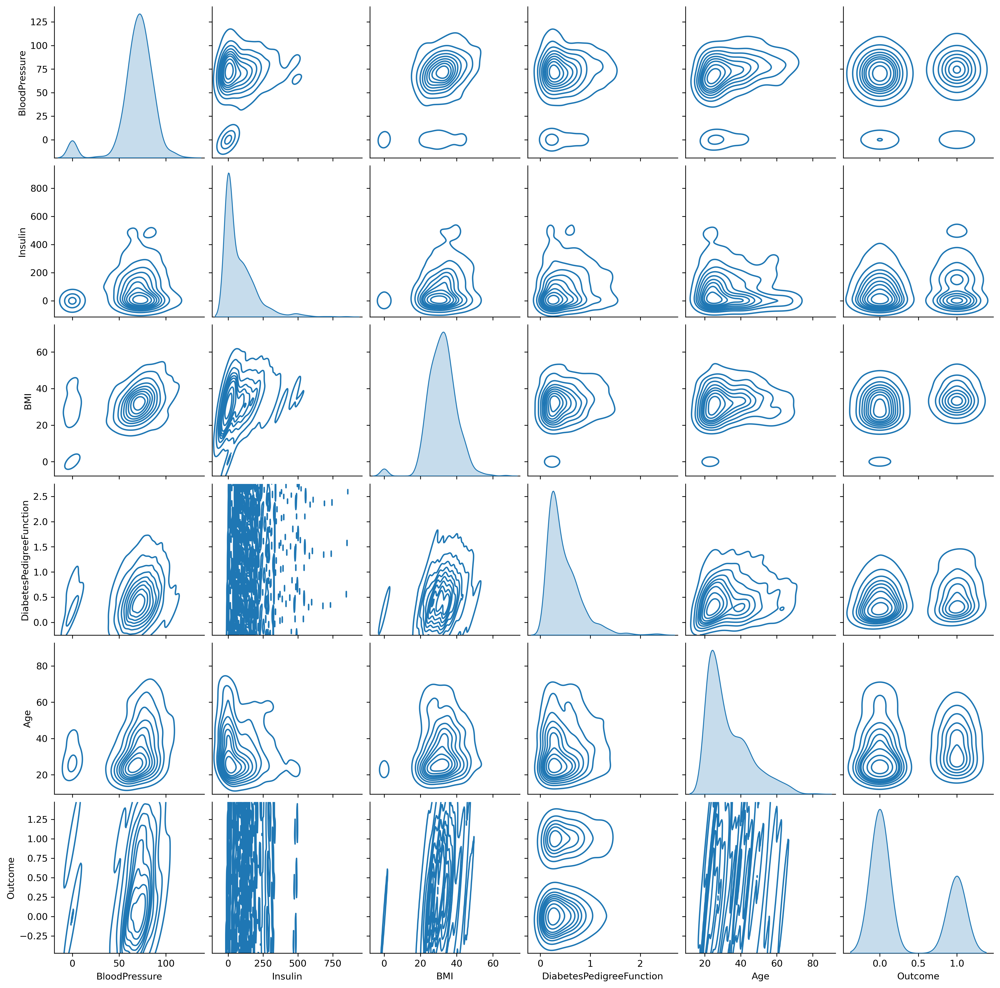

# Remove Correlations
Automatically removes correlated columns from a csv file. Outputs a new csv and a pair plot of the uncorrelated columns for futher analysis

## Instalation
``` bash
git clone https://github.com/robshan5/remove_correlations
cd remove_correlations
```
## Usage
- Run the program with:
```
python main.py -f csv_file -t threshold_value -c column_file
```
### File
` -f --file `
- field for the csv file that you want to remove the correlated columns from.
- required field
### Threshold
` -t --threshold `
- optional if you want a custom correlation threshold value
- default value = 0.5
### Columns
` -c --columns `
- optional if you want to select only certain columns to analyse
- pass in a text file with each column on a seperate line
- outputs a csv with the other columns, only the correlated columns are removed

## Pair Plot
- Example pair plot for a diabetes dataset taken from https://www.kaggle.com/code/paultimothymooney/predict-diabetes-from-medical-records

